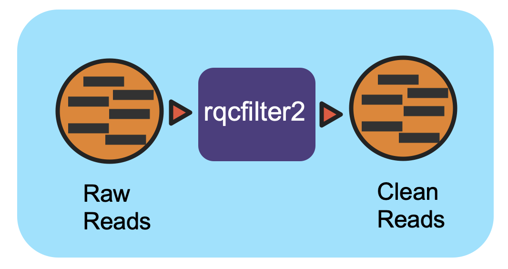
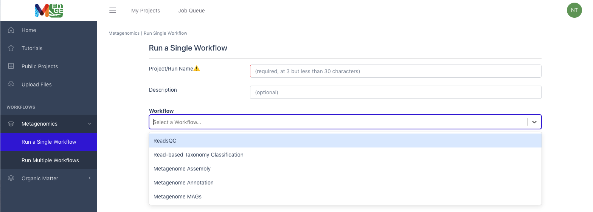
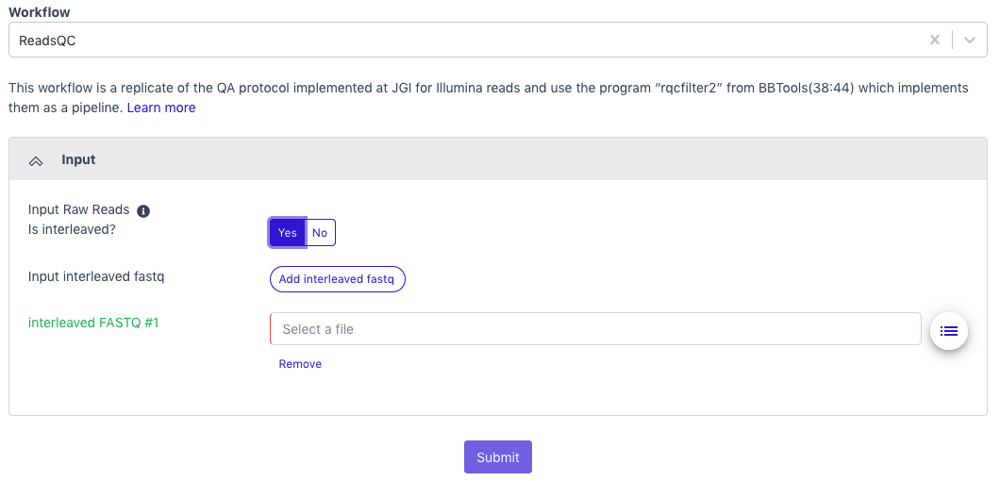
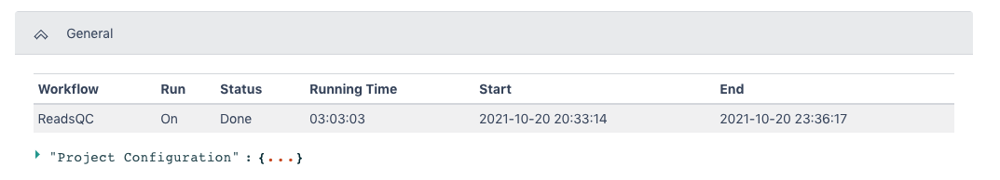
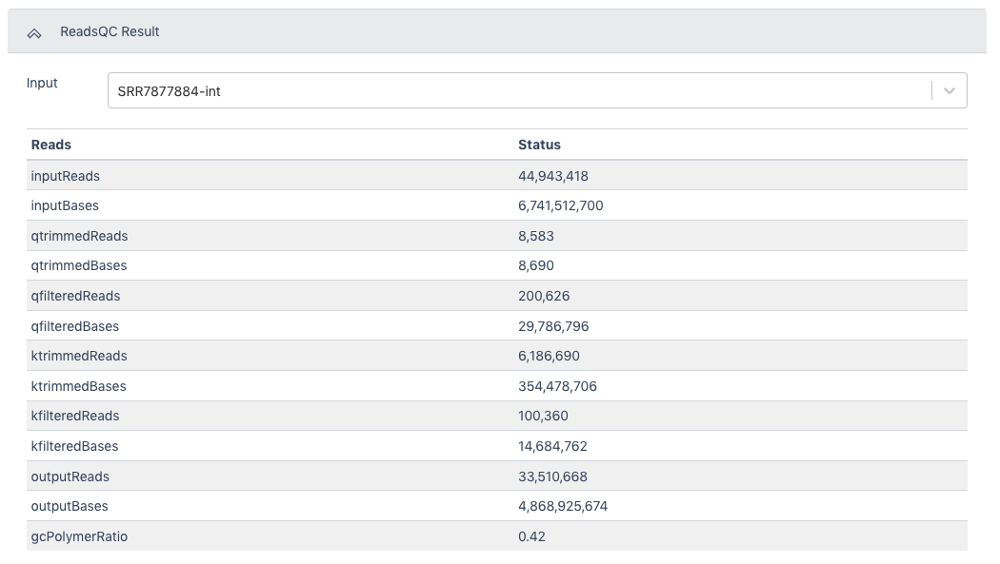
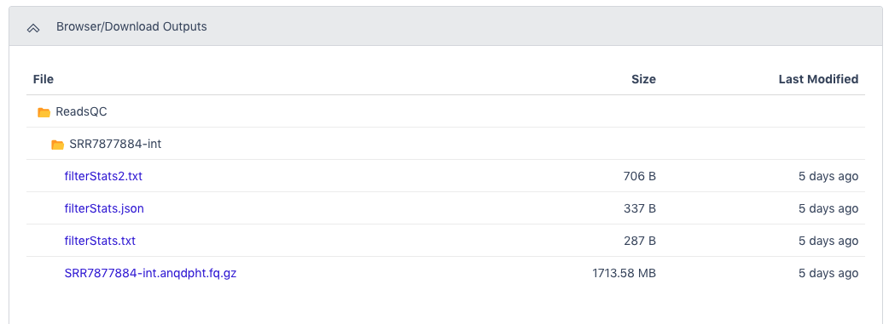

### Reads QC Workflow (v1.0.1)

#### Overview

This workflow performs quality control on raw Illumina reads to
trim/filter low quality data and to remove artifacts, linkers, adapters,
spike-in reads and reads mapping to several hosts and common microbial
contaminants.

#### Running the Workflow

Currently, this workflow is available in
[GitHub](https://github.com/microbiomedata/ReadsQC) and can be run from
the command line. (CLI instructions and requirements are found
[here](https://nmdc-workflow-documentation.readthedocs.io/en/latest/chapters/1_RQC_index.html).)
Alternatively, this workflow can be run in [NMDC
EDGE](https://nmdc-edge.org/).

#### Input

Metagenome ReadsQC requires paired-end Illumina data as an interleaved
file or as separate pairs of FASTQ files.

-   **Acceptable file formats:** .fastq, .fq, .fastq.gz, .fq.gz

#### Details

This workflow performs quality control on raw Illumina reads using
rqcfilter2. The workflow performs quality trimming, artifact removal,
linker trimming, adapter trimming, and spike-in removal using bbduk, and
performs human/cat/dog/mouse/microbe removal using bbmap. Full
documentation can be found in
[ReadtheDocs](https://nmdc-workflow-documentation.readthedocs.io/en/latest/chapters/1_RQC_index.html).

#### Software Versions 

-   rqcfilter2 (BBTools v38.94)

-   bbduk (BBTools v38.94)

-   bbmap (BBTools v38.94)

#### Output

Multiple output files are provided by the workflow; the primary files
are shown below. The full list of output files can be found in
[ReadtheDocs](https://nmdc-workflow-documentation.readthedocs.io/en/latest/chapters/1_RQC_index.html).

| Primary Output Files      |            Description                                    |
| ------------------------- | --------------------------------------------------------- |
| Filtered Sequencing Reads | Cleaned paired-end data in interleaved format (.fastq.gz) |
| QC statistics (2 files)   | Reads QC summary statistics (.txt)                        |

#### Running the Reads QC Workflow in NMDC EDGE

Select a workflow

1.  From the Metagenomics category in the left menu bar, select 'Run a
    Single Workflow'.

2.  Enter a ***[unique]{.underline}*** project name with no spaces
    (underscores are fine).

3.  A description is optional, but helpful.

4.  Select 'ReadsQC' from the dropdown menu under Workflow.

Input

ReadsQC requires paired-end Illumina data in FASTQ format as the input;
the file can be interleaved and can be compressed. **Acceptable file
formats:** .fastq, .fq, .fastq.gz, .fq.gz

5.  The default setting is for the raw data to be in an interleaved
    format (paired reads interleaved into one file). If the raw data is
    paired reads in separate files (forward and reverse), click 'No'.

6.  Additional data files (of the same type--interleaved or separate)
    can be added with the button below.

7.  Click the button to the right of the input blank for data to select
    the data file for the analysis. (If there are separate files, there
    will be two input blanks.) A box called 'Select a File' will open to
    allow the user to find the desired file(s) from previously run
    projects, the public data folder, or files uploaded by the user.

8.  Then click 'Submit'.

> 

Output

The General section of the output shows which workflow was run and the
run time information.

The ReadsQC Result section shows the data input and provides a variety
of metrics including the number of reads and bases before and after
trimming and filtering.

The Browser/Download Output section provides output files available to
download. The clean data will be in an interleaved .fq.gz file. General
QC statistics are in the filterStats.txt file.

